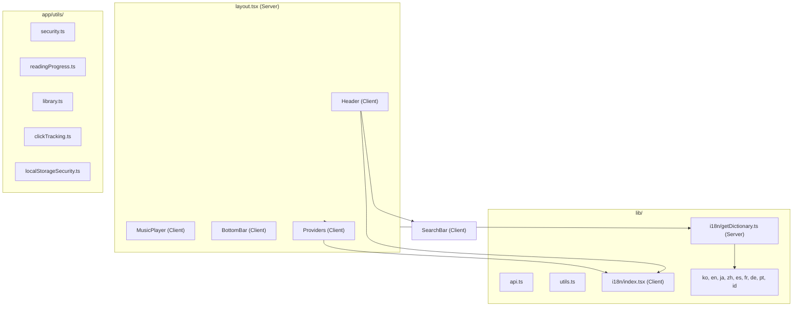
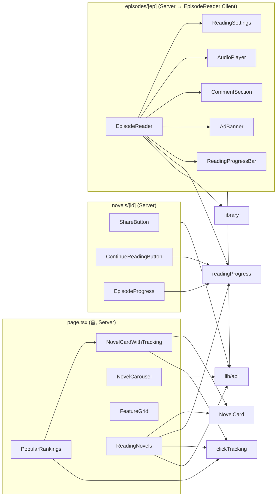

# NARRA-WEB 의존성 지도

> 최종 업데이트: 2026-03-03

## 아키텍처 개요



---

## 렌더링 모드 분류

### 🟢 서버 컴포넌트 (Server Components)

| 파일 | 주요 의존성 |
|------|------------|
| `layout.tsx` | Header, MusicPlayer, BottomBar, Providers, getDictionary |
| `page.tsx` (홈) | fetchNovels, NovelCardWithTracking, NovelCarousel, FeatureGrid, PopularRankings, ReadingNovels |
| `novels/page.tsx` | fetchNovels, NovelCard |
| `novels/[id]/page.tsx` | fetchNovelById, fetchEpisodesByNovelId, ShareButton, ContinueReadingButton, EpisodeProgress, utils |
| `novels/[id]/episodes/[ep]/page.tsx` | fetchEpisodeContent, fetchEpisodesByNovelId, fetchNovelById, EpisodeReader |
| `browse/page.tsx` | fetchNovels, BrowseClient |
| `browse/new/page.tsx` | fetchNovels, NovelCard |
| `browse/recommended/page.tsx` | fetchNovels, NovelCard |
| `authors/page.tsx` | fetchAuthors, AuthorCard |
| `authors/[id]/page.tsx` | fetchAuthorById |
| `terms/page.tsx` | cookies, Locale |
| `privacy/page.tsx` | cookies, Locale |
| `support/page.tsx` | cookies, getDictionary, AccordionItem |
| `library/page.tsx` | redirect (서버 리다이렉트) |

### 🔴 클라이언트 컴포넌트 (Client Components)

**페이지 (Pages):**

| 파일 | 주요 의존성 | 클라이언트 필수 이유 |
|------|------------|---------------------|
| `community/page.tsx` | security, useLocale | useState×8, fetch, localStorage |
| `fanart/page.tsx` | security, useLocale | useState×7, localStorage, FileReader |
| `mypage/page.tsx` | readingProgress, library, fetchNovels, NovelCard, utils, useLocale | useState×15, useEffect×4, localStorage, useRouter |
| `premium/page.tsx` | useLocale | useState×5, useEffect×3, localStorage, fetch |
| `pricing/page.tsx` | useLocale | useState, useEffect |
| `login/page.tsx` | security, localStorageSecurity, useLocale | useState×7, localStorage |
| `signup/page.tsx` | security, localStorageSecurity, useLocale | useState×8, localStorage |
| `settings/page.tsx` | useLocale, LOCALE_NAMES | useState×4, localStorage |
| `daily-checkin/page.tsx` | useLocale | useState, useEffect, localStorage |
| `music/page.tsx` | useLocale | useState, useEffect |
| `dashboard/page.tsx` | — | useRouter, useEffect, localStorage |
| `dashboard/novels/create/page.tsx` | useLocale | useState×10+, fetch |
| `dashboard/novels/[id]/page.tsx` | useLocale, EntityManager | useState×15+, fetch |
| `dashboard/novels/[id]/edit/page.tsx` | useLocale, EntityManager | useState×10+, fetch |
| `dashboard/novels/[id]/episodes/new/page.tsx` | useLocale | useState×5+, fetch |
| `dashboard/novels/[id]/episodes/[ep]/edit/page.tsx` | useLocale | useState×5+, fetch |

**UI 컴포넌트 (Components):**

| 컴포넌트 | 사용처 | 의존성 |
|----------|--------|--------|
| `Header` | layout | SearchBar, useLocale |
| `SearchBar` | Header | useState |
| `MusicPlayer` | layout | useState, useEffect |
| `BottomBar` | layout | useLocale |
| `Providers` | layout | LocaleProvider |
| `NovelCarousel` | page(홈) | useState, useEffect |
| `NovelCardWithTracking` | page(홈), PopularRankings | NovelCard, clickTracking |
| `NovelCard` | 여러 곳 | NovelCard.module.css |
| `PopularRankings` | page(홈) | NovelCardWithTracking, clickTracking, useLocale |
| `ReadingNovels` | page(홈) | readingProgress, clickTracking, fetchNovels, NovelCard, utils, useLocale |
| `FeatureGrid` | page(홈) | useLocale |
| `BrowseClient` | browse | NovelCard, BrowseFilters, useLocale |
| `BrowseFilters` | BrowseClient | useState |
| `EpisodeReader` | episodes/[ep] | ReadingSettings, AudioPlayer, ShareButton, CommentSection, AdBanner, ReadingProgressBar, readingProgress, library, utils |
| `ReadingSettings` | EpisodeReader | useState |
| `AudioPlayer` | EpisodeReader | useState, useEffect |
| `CommentSection` | EpisodeReader | useState |
| `AdBanner` | EpisodeReader | useState |
| `ReadingProgressBar` | EpisodeReader | — |
| `ShareButton` | novels/[id], EpisodeReader | useState |
| `ContinueReadingButton` | novels/[id] | readingProgress |
| `EpisodeProgress` | novels/[id] | readingProgress |
| `EpisodeListItem` | novels/[id] | utils (formatRelativeTime) |
| `FavoriteButton` | novels/[id] | readingProgress, library |
| `BookmarkButton` | — | useState |
| `StarRating` | — | useState |
| `StartReadingButton` | — | useState |
| `AuthorCard` | authors | — |
| `MobileMenu` | Header | NavMenu |
| `NavMenu` | MobileMenu | — |
| `LanguageLearningMode` | EpisodeReader | useState |
| `AccordionItem` | support | useState |

---

## 핵심 모듈 의존 관계

### `lib/api.ts` — 데이터 페칭 (서버/클라이언트 양용)

```
fetchNovels()            ← page(홈), browse, browse/new, browse/recommended, novels, mypage, ReadingNovels
fetchAuthors()           ← authors
fetchAuthorById(id)      ← authors/[id]
fetchNovelById(id)       ← novels/[id], episodes/[ep]
fetchEpisodesByNovelId() ← novels/[id], episodes/[ep]
fetchEpisodeContent()    ← episodes/[ep]
```

### `lib/utils.ts` — 유틸리티 함수

```
toRoman()            ← novels/[id], EpisodeReader, ReadingNovels, mypage
formatViewCount()    ← novels/[id]
formatRelativeTime() ← EpisodeListItem
```

### `lib/i18n/` — 국제화

```
useLocale()     ← 거의 모든 클라이언트 컴포넌트 (25+ 파일)
LocaleProvider  ← Providers → layout
getDictionary() ← layout, support (서버 전용)
Locale type     ← terms, privacy, support, layout
```

### `app/utils/` — 클라이언트 유틸리티 (모두 localStorage 의존)

```
readingProgress.ts  ← ContinueReadingButton, EpisodeProgress, EpisodeReader, FavoriteButton, ReadingNovels, mypage
library.ts          ← EpisodeReader, FavoriteButton, mypage
clickTracking.ts    ← NovelCardWithTracking, PopularRankings, ReadingNovels
security.ts         ← community, fanart, login, signup
localStorageSecurity.ts ← login, signup
```

---

## 페이지별 전체 의존 체인



---

## API Routes (Next.js App Router)

| 경로 | 메서드 | 용도 |
|------|--------|------|
| `api/novels/route.ts` | GET | 소설 목록 프록시 |
| `api/novels/[id]/route.ts` | GET | 소설 상세 프록시 |
| `api/novels/[id]/episodes/route.ts` | GET | 에피소드 목록 프록시 |
| `api/episodes/[id]/view/route.ts` | POST | 조회수 증가 |
| `api/episodes/[id]/comments/route.ts` | GET/POST | 댓글 관리 |

> 모든 API 라우트는 `narra-storage` 백엔드로 프록시. `NEXT_PUBLIC_STORAGE_BASE_URL` 환경변수 사용.

---

## 외부 서비스 의존

```
narra-web ──fetch──→ narra-storage (Cloudflare Workers + D1/R2)
                      ├── /api/novels/*
                      ├── /api/authors/*
                      ├── /api/community/*
                      ├── /api/user/*
                      └── /api/auth/*
```
